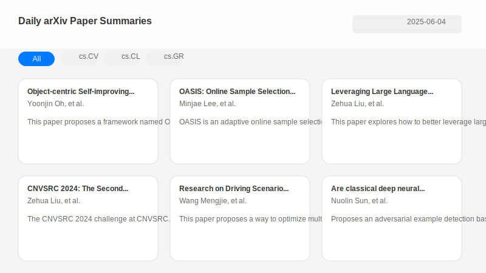

# daily-arXiv-ai-enhanced

> Your auto-updating, AI-summarized arXiv digest — zero servers, free on GitHub Pages.

**daily-arXiv-ai-enhanced** automatically crawls new arXiv papers every day, summarizes them with an LLM, and publishes a clean, searchable web digest — all on free GitHub infrastructure. This is an English-language fork tailored to my own research interests.

👉 **Live site: https://wlsgur073.github.io/daily-arXiv-ai-enhanced/**

  

<!-- TODO: replace css/screenshot-placeholder.svg with a real screenshot of the live site -->

## ✨ Features

- 🎯 **Zero infrastructure** — runs entirely on GitHub Actions + Pages. No server, free to host.
- 🤖 **AI summarization** — daily arXiv crawl with DeepSeek-powered summaries (TL;DR, motivation, method, result, conclusion). Cost depends on your own LLM API usage.
- 💫 **Smart reading experience** — personalized highlighting based on your interests, desktop & mobile support, local (private) preference storage, and flexible date-range filtering.
- 🧩 **SKILL system** — plug-and-play modules for customizing paper filtering (see [`SKILL/SKILL.md`](./SKILL/SKILL.md)).
- ⚙️ **Preference export** — one-click copy of your keywords and authors in **Settings** to reuse or share with the SKILL system.

## 📚 What this fork tracks

By default this deployment crawls **`cs.CL, cs.SE, cs.HC, cs.AI, cs.IR, cs.CR, cs.LG, cs.MA`** and summarizes papers in **English** using **DeepSeek (`deepseek-v4-pro`)**. Change any of these at any time through the repository **Variables** (see [Configuration](#️-configuration)).

## 🚀 Quick start

Deploy your own copy in a few minutes — no server required.

1. **Fork** this repository to your account.
2. Open **Settings → Secrets and variables → Actions**.
3. Under **Secrets**, add your LLM credentials (and optional extras) — see [Configuration](#️-configuration).
4. Under **Variables**, set your categories, summary language, model, and Git author info.
5. Open the **Actions** tab, enable workflows, and run **arXiv-daily-ai-enhanced** once to test (it can take a while). After that it runs automatically every day.
6. Enable **GitHub Pages**: **Settings → Pages → Build and deployment**, set **Source = "Deploy from a branch"** and **Branch = `main` / `(root)`**. After a few minutes your site is live at `https://<your-username>.github.io/daily-arXiv-ai-enhanced/`.

> **Notes**
> - `permissions: contents: write` is already declared in the workflow, so the daily job can push its results — no extra repository-permission setup needed.
> - If you use a DeepSeek **thinking** model (e.g. `deepseek-v4-pro`), the pipeline automatically disables thinking mode so structured (function-calling) summarization works correctly.

## ⚙️ Configuration

**Secrets** — *Settings → Secrets and variables → Actions → Secrets*

| Secret | Required | Description |
| --- | --- | --- |
| `OPENAI_API_KEY` | ✅ | Your LLM API key (e.g. from [platform.deepseek.com](https://platform.deepseek.com)) |
| `OPENAI_BASE_URL` | ✅ | Your provider's API base URL (e.g. `https://api.deepseek.com`) |
| `ACCESS_PASSWORD` | optional | Set to password-protect your published page |
| `TOKEN_GITHUB` | optional | A GitHub token to raise API rate limits when fetching code-repo info for papers |

**Variables** — *Settings → Secrets and variables → Actions → Variables*

| Variable | Example | Description |
| --- | --- | --- |
| `CATEGORIES` | `cs.CL, cs.AI, cs.LG` | arXiv categories to crawl (comma-separated) |
| `LANGUAGE` | `English` | Language for the AI summaries |
| `MODEL_NAME` | `deepseek-v4-pro` | LLM model id |
| `EMAIL` | `you@example.com` | Git author email for the automated commits |
| `NAME` | `your-name` | Git author name for the automated commits |

## 🧠 How it works

- **`main` branch** — the static site (HTML/CSS/JS) and configuration.
- **`data` branch** — the daily crawled and AI-enhanced papers (JSONL + Markdown).
- The site is served by **GitHub Pages** from `main` and fetches each day's papers from the `data` branch at runtime via `raw.githubusercontent.com` (configured in [`js/data-config.js`](./js/data-config.js)).
- A scheduled **GitHub Actions** workflow ([`.github/workflows/run.yml`](./.github/workflows/run.yml)) runs daily: **crawl arXiv → AI-summarize → commit results to the `data` branch**.

## 🧩 SKILL system

The repository ships a plug-and-play SKILL module for programmatic paper filtering. See [`SKILL/SKILL.md`](./SKILL/SKILL.md) for usage, and combine it with the keyword/author preferences you export from the **Settings** page for reproducible, shareable setups.

## 📄 License

Distributed under the **Modified Apache License 2.0** — see [`LICENSE`](./LICENSE).

> ⚠️ This tool accesses and processes third-party content from arXiv. You are solely responsible for complying with arXiv's terms of use and any laws applicable in your jurisdiction. See `LICENSE` §9 (Disclaimer for Third-Party Content).

## 🙏 Acknowledgements

This project is a **modified fork** of [**dw-dengwei/daily-arXiv-ai-enhanced**](https://github.com/dw-dengwei/daily-arXiv-ai-enhanced) (Modified Apache License 2.0); files have been changed from the original. Huge thanks to the original author **Wei Deng** and the upstream contributors for building the foundation this fork is based on.
